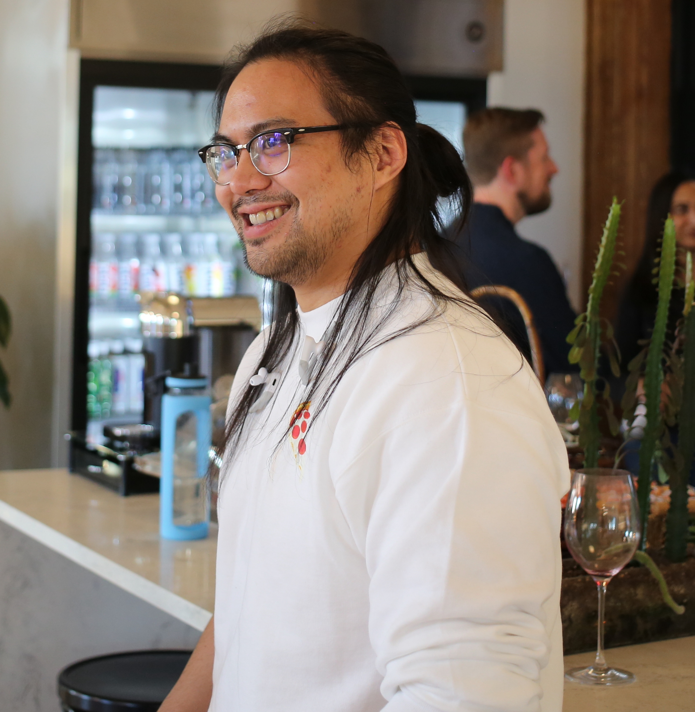

# A Guide to Working with Jason Andrada

Brooklyn, NY (GMT-4)

Born July 20, 1994

Software Engineer, UX Designer

## Introduction
A core requirement for collaboration is establishing a sincere, genuine connection with the individual on the other side. This guide is meant to surface my most authentic professional self so that I, the engineer, and you, the reader, can most effectively communicate and collaborate.

## How I View Success

## How I Communicate

## Things I Do that May Annoy You

## What Gains My Trust

## What Loses My Trust

## My Strengths

## My Growth Areas

## My Personal Measures of Collaboration

## How I Give and Receive Feedback

## My Reference Books
